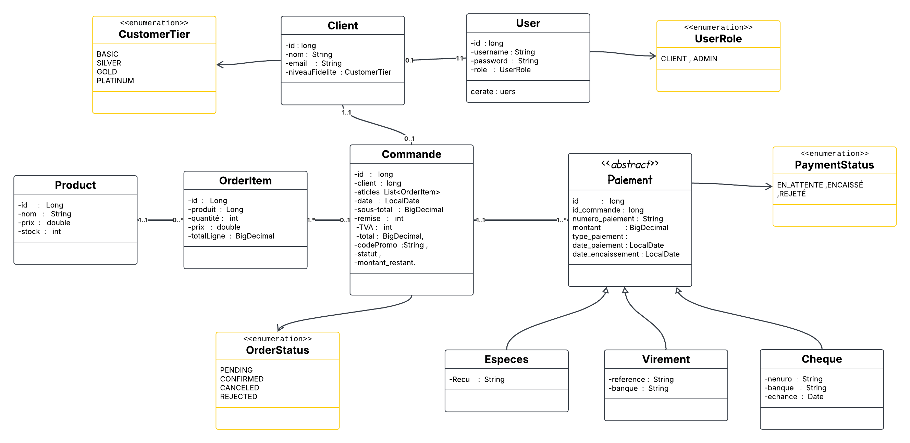

# SmartShop - Système de Gestion Commerciale B2B

## 📋 Description

SmartShop est une application backend REST API de gestion commerciale développée pour **MicroTech Maroc**, distributeur B2B de matériel informatique basé à Casablanca. L'application permet de gérer un portefeuille de 650 clients actifs avec un système de fidélité à remises progressives et des paiements fractionnés multi-moyens.

## 🎯 Objectifs du Projet

- Gestion complète des clients et de leur fidélité
- Système de commandes multi-produits avec remises automatiques
- Paiements fractionnés avec plusieurs moyens de paiement
- Traçabilité complète des événements financiers
- Optimisation de la gestion de trésorerie

## 🛠️ Technologies Utilisées

- **Java** : Version 17+
- **Spring Boot** : Framework principal
- **Spring Data JPA/Hibernate** : ORM pour la persistance
- **MySQL** : Base de données relationnelle
- **Lombok** : Simplification du code
- **MapStruct** : Conversion DTO ↔ Entity
- **JUnit & Mockito** : Tests unitaires
- **Swagger/Postman** : Documentation et tests d'API

## 🏗️ Architecture

L'application suit une architecture en couches :

```
├── Controller     (Endpoints REST)
├── Service        (Logique métier)
├── Repository     (Accès aux données)
├── Entity         (Modèle de données)
├── DTO            (Data Transfer Objects)
├── Mapper         (Conversion DTO/Entity)
└── Exception      (Gestion centralisée des erreurs)
```

## 📊 Modèle de Données

### Entités Principales

### Entités Principales

- **User** : Gestion des utilisateurs avec authentification (ADMIN/CLIENT)
- **Client** : Informations clients et statistiques de fidélité (niveau, commandes, montant cumulé)
- **Product** : Catalogue de produits avec gestion du stock et soft delete
- **Order** : Commandes avec calcul automatique des remises et TVA
- **OrderItem** : Lignes de commandes (produit + quantité + prix unitaire)
- **Payment** : Classe abstraite pour les paiements fractionnés
    - **Especes** : Paiement en espèces (limite 20,000 DH, statut: Encaissé)
    - **Cheque** : Paiement par chèque (numéro, banque, échéance, statut: En attente/Encaissé/Rejeté)
    - **Virement** : Paiement par virement bancaire (référence, banque, statut: En attente/Encaissé/Rejeté)

### Enums du Système

- **UserRole** : `ADMIN`, `CLIENT`
- **CustomerTier** : `BASIC`, `SILVER`, `GOLD`, `PLATINUM`
- **OrderStatus** : `PENDING`, `CONFIRMED`, `CANCELED`, `REJECTED`
- **PaymentStatus** : `EN_ATTENTE`, `ENCAISSÉ`, `REJETÉ`

## ⚙️ Fonctionnalités Principales

### 1. Gestion des Clients
- CRUD complet des clients
- Statistiques automatiques (commandes, montant cumulé)
- Historique des commandes

### 2. Système de Fidélité Automatique
Calcul automatique du niveau basé sur l'historique :
- **BASIC** : Par défaut (0 commande)
- **SILVER** : 3+ commandes OU 1,000 DH cumulés
- **GOLD** : 10+ commandes OU 5,000 DH cumulés
- **PLATINUM** : 20+ commandes OU 15,000 DH cumulés

Remises selon le niveau :
- **SILVER** : 5% si sous-total ≥ 500 DH
- **GOLD** : 10% si sous-total ≥ 800 DH
- **PLATINUM** : 15% si sous-total ≥ 1,200 DH

### 3. Gestion des Produits
- CRUD des produits
- Soft delete si commandes existantes
- Filtres et pagination

### 4. Gestion des Commandes
- Création multi-produits avec validation du stock
- Calcul automatique :
    - Sous-total HT
    - Remise fidélité + code promo (cumulables)
    - TVA 20% (sur montant après remise)
    - Total TTC
- Mise à jour automatique du stock et des statistiques client

### 5. Paiements Multi-Moyens
Trois moyens de paiement acceptés :
- **ESPÈCES** : Limite 20,000 DH par paiement
- **CHÈQUE** : Avec numéro, banque et échéance
- **VIREMENT** : Avec référence et banque

⚠️ **Règle importante** : Une commande doit être totalement payée avant validation par l'ADMIN.

## 🔐 Authentification & Autorisations

### Système d'Authentification
- HTTP Session (login/logout)
### Rôles et Permissions

**CLIENT** :
- Consulter son profil et niveau de fidélité
- Voir son historique de commandes
- Consulter le catalogue produits (lecture seule)

**ADMIN** :
- Toutes les opérations CRUD
- Créer des commandes pour tous les clients
- Enregistrer les paiements
- Valider/Annuler/Rejeter les commandes

## 🚀 Installation et Configuration

### Prérequis
- Java 8+
- Maven 3.6+
- MySQL
- Postman et Swagger

### Étapes d'installation

1. **Cloner le repository**
```bash
git clone https://github.com/lakrounehamza/SmartShop.git
cd smartshop
```

2. **Configurer la base de données**
```properties
# application.yaml
spring:
datasource:
url: jdbc:postgresql://localhost:3306/smartshop
username: votre_username
password: votre_password
jpa:
hibernate:
ddl-auto: update

```

3. **Compiler le projet**
```bash
mvn clean install
```

4. **Lancer l'application**
```bash
mvn spring-boot:run
```

L'application sera accessible sur : `http://localhost:8080`

## 📝 Documentation API
- Swagger : http://localhost:8080/swagger-ui.html
- Postman : 


### Endpoints Principaux

#### Authentification
- `POST /api/auth/login` : Connexion
- `POST /api/auth/logout` : Déconnexion

#### Clients
- `GET /api/clients` : Liste des clients
- `GET /api/clients/{id}` : Détails d'un client
- `POST /api/clients` : Créer un client
- `PUT /api/clients/{id}` : Modifier un client
- `DELETE /api/clients/{id}` : Supprimer un client
- `GET /api/clients/{id}/orders` : Historique des commandes

#### Produits
- `GET /api/products` : Liste des produits
- `GET /api/products/{id}` : Détails d'un produit
- `POST /api/products` : Créer un produit
- `PUT /api/products/{id}` : Modifier un produit
- `DELETE /api/products/{id}` : Supprimer un produit

#### Commandes
- `GET /api/orders` : Liste des commandes
- `GET /api/orders/{id}` : Détails d'une commande
- `POST /api/orders` : Créer une commande
- `PUT /api/orders/{id}/confirm` : Valider une commande (ADMIN)
- `PUT /api/orders/{id}/cancel` : Annuler une commande (ADMIN)

#### Paiements
- `POST /api/payments` : Enregistrer un paiement
- `GET /api/orders/{id}/payments` : Liste des paiements d'une commande

## 🧪 Tests

### Lancer les tests unitaires
```bash
mvn test
```

### Collection Postman
Une collection Postman complète est disponible dans le dossier `/postman` avec tous les endpoints testés.

## 📐 Diagramme de Classes UML

Le diagramme de classes UML


## ⚠️ Règles Métier Critiques

1. **Validation stock** : quantité demandée ≤ stock disponible
2. **Arrondis** : Tous les montants à 2 décimales
3. **Codes promo** : Format strict `PROMO-XXXX`, usage unique possible
4. **TVA** : 20% par défaut (paramétrable)
5. **Limite espèces** : Maximum 20,000 DH par paiement (loi marocaine)
6. **Validation commande** : Possible uniquement si totalement payée

## 🎓 Gestion des Erreurs

Codes HTTP utilisés :
- `400` : Erreur de validation
- `401` : Non authentifié
- `403` : Accès refusé
- `404` : Ressource inexistante
- `422` : Règle métier violée
- `500` : Erreur interne

Format de réponse d'erreur :
```json
{
  "timestamp": "2025-11-26T10:30:00",
  "status": 422,
  "error": "Unprocessable Entity",
  "message": "Stock insuffisant pour le produit XYZ",
  "path": "/api/orders"
}
```

## 📈 Exemple d'Utilisation

### Scénario : Création d'une commande avec remise fidélité

1. Client SILVER (5% de remise si ≥ 500 DH)
2. Commande de 2 produits : 600 DH HT
3. Code promo : `PROMO-TECH` (+5%)
4. Calcul automatique :
    - Sous-total HT : 600 DH
    - Remise fidélité (5%) : -30 DH
    - Remise promo (5%) : -30 DH
    - Montant HT après remise : 540 DH
    - TVA 20% : 108 DH
    - **Total TTC : 648 DH**

## 👥 Contributeurs

- **Votre Nom** - Développeur Full Stack Java

## 📄 Licence

Ce projet est développé dans le cadre d'une formation à **YouCode** - MicroJavaneers

## 📞 Contact

Pour toute question ou suggestion :
- Email : lakrounehamza10@gmail.com
- GitHub : [@lakorunehamza](https://github.com/lakrounehamza)

---

**Date de création** : 09:30 24/11/2025  
**Version** : 1.0.0  
**Statut** : En développement